<div align="center">

<!-- Animated Header -->


<!-- Typing Animation -->
<a href="https://git.io/typing-svg">
  
</a>

<br/>

<!-- Quick Links -->
[](https://hrideymarwah.online)
[](https://www.linkedin.com/in/hridey-marwah)
[](mailto:hrideymarwah2907@gmail.com)

<br/>


</div>

---

<!-- About Section with Metrics -->
<table>
<tr>
<td width="50%" valign="top">

### 🧑‍💻 About Me

```javascript
const hridey = {
  location: "Sonipat, India 🇮🇳",
  education: "Rishihood University",
  roles: ["Full-Stack Dev", "Open Source Contributor"],
  currentFocus: "Building scalable web apps",
  
  skills: {
    languages: ["TypeScript", "JavaScript", "Python"],
    frontend: ["React", "Next.js", "TailwindCSS"],
    backend: ["Node.js", "Express", "Supabase"],
    databases: ["MongoDB", "PostgreSQL"],
    tools: ["Git", "Docker", "VS Code"]
  },
  
  currentlyLearning: ["Cloud Architecture", "System Design"],
  funFact: "I think console.log is a valid debugger 😄"
};
```

</td>
<td width="50%" valign="top">



</td>
</tr>
</table>

---

## 📅 Contribution Calendar

<div align="center">
  
</div>

---

## 🏆 Achievements Unlocked

<div align="center">
  
</div>

---

<table>
<tr>
<td width="50%" valign="top">

## ⏰ Coding Habits


</td>
<td width="50%" valign="top">

## 🎟️ Issues & PRs


</td>
</tr>
</table>

---

## 📰 Recent Activity

<div align="center">
  
</div>

---

<table>
<tr>
<td width="50%" valign="top">

## 🌟 Recently Starred


</td>
<td width="50%" valign="top">

## ♐ Code Snippet


</td>
</tr>
</table>

---

## 🛠️ Tech Arsenal

<div align="center">

<table>
<tr>
<td align="center" width="96">
  
  <br>TypeScript
</td>
<td align="center" width="96">
  
  <br>JavaScript
</td>
<td align="center" width="96">
  
  <br>Python
</td>
<td align="center" width="96">
  
  <br>React
</td>
<td align="center" width="96">
  
  <br>Next.js
</td>
<td align="center" width="96">
  
  <br>Tailwind
</td>
</tr>
<tr>
<td align="center" width="96">
  
  <br>Node.js
</td>
<td align="center" width="96">
  
  <br>Supabase
</td>
<td align="center" width="96">
  
  <br>MongoDB
</td>
<td align="center" width="96">
  
  <br>Docker
</td>
<td align="center" width="96">
  
  <br>Git
</td>
<td align="center" width="96">
  
  <br>VS Code
</td>
</tr>
</table>

</div>

---

<div align="center">

## 🤝 Let's Connect & Collaborate!

<br/>

*I'm always excited to work on interesting projects and meet fellow developers.*  
*Whether it's open source, freelance, or just a tech chat - reach out!*

<br/>

[](https://github.com/hrideymarwah15)
[](https://hrideymarwah.online)

<br/>

<!-- Footer Wave -->


</div>

<!-- 📊 Auto-generated metrics using lowlighter/metrics - Updates every 6 hours -->
